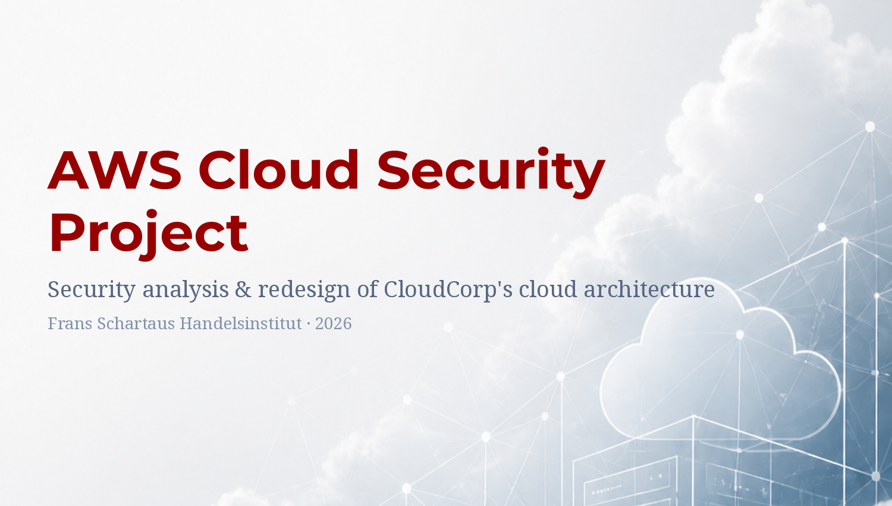

<a id="readme-top"></a>



# AWS Cloud Security Project

[](https://github.com/DanielHallbro/AWS_Cloud_Security_Project)
[](https://aws.amazon.com/)
[](https://www.terraform.io/)
[](LICENSE)
[](https://github.com/DanielHallbro/AWS_Cloud_Security_Project)
[](https://www.franz-schartau.se/)

**Author:** Daniel Hållbro (Student)
**School:** Frans Schartaus Handelsinstitut
**Course:** Cloud and Virtual Service Security (30P)
**Year:** 2026

### [Download Report (PDF)](https://github.com/DanielHallbro/AWS_Cloud_Security_Project/releases/latest/download/CloudCorp_Report.pdf) |  [Download Appendix A (PDF)](https://github.com/DanielHallbro/AWS_Cloud_Security_Project/releases/latest/download/CloudCorp_Appendix_A.pdf) |  [Download Presentation (PDF)](https://github.com/DanielHallbro/AWS_Cloud_Security_Project/releases/latest/download/CloudCorp_Presentation.pdf)

*(Direct download links via GitHub Releases)*

---

This repository contains the deliverables for an individual project in the course **Cloud and Virtual Service Security**. The project analyses a fictional AWS security incident at a SaaS company called CloudCorp, designs a new secure architecture, implements it on AWS, and evaluates the result against cost, risk, and best practices.

The work is published here in the spirit of transparency and as part of a public portfolio. All cost figures, configuration choices, and design trade-offs are documented in the report and its appendix so the reasoning can be reviewed and challenged.

---

## Table of Contents

- [Project Overview](#project-overview)
- [The Scenario](#the-scenario)
- [Deliverables](#deliverables)
- [Repository Structure](#repository-structure)
- [Terraform](#terraform)
- [Disclaimer](#disclaimer)

---

## Project Overview

The project is structured around six parts that together build a complete security narrative:

1. **Incident analysis** — What went wrong, which security principles were broken, and how the failures map to the CIA triad (Confidentiality, Integrity, Availability).
2. **New architecture** — A redesigned AWS environment built around defence in depth, least privilege, and minimal attack surface, with a full architecture diagram.
3. **Implementation** — Concrete AWS resource configuration: VPC and subnets, compute and storage layers, IAM with separation of duties, and the observability stack that the original architecture lacked.
4. **Network and secure design** — Subnet motivation (public vs private), Security Group chain pattern, and attack-surface minimisation.
5. **Security analysis** — Five concrete remaining risks with proposed improvements and cost trade-offs.
6. **Cost and cloud service models** — IaaS/PaaS/SaaS distinction and a verified monthly cost of ~$335 (3,520 SEK) modelled in AWS Pricing Calculator.

The final report is structured to demonstrate not just *what* was chosen but *why* — every control is motivated against a concrete risk, and every cost is weighed against what it protects.

<p align="right">(<a href="#readme-top">back to top</a>)</p>

---

## The Scenario

The teacher provided a fictional case to analyse. A short summary is below; the full original scenario is included in the dropdown for transparency.

**In short:** CloudCorp is a SaaS company that suffered a data breach after migrating to AWS without sufficient security expertise. A misconfigured public S3 bucket exposed customer data, and an EC2 instance had SSH open to the entire internet. There was no logging, no network segmentation, and no IAM least-privilege model. The project's task is to analyse what went wrong and design a new secure architecture in its place.

<details>
<summary><strong>📋 Full original scenario (provided by teacher)</strong></summary>

> **CloudCorp** is a SaaS company that handles customer data through a web service. They have recently migrated to AWS but lack deep security expertise.
>
> **Existing architecture:**
> - A VPC with only one public subnet
> - An EC2 instance (frontend + backend) with public IP
> - Security Groups with open ports (80 and 22 to 0.0.0.0/0)
> - No network segmentation or bastion host
>
> **Storage:**
> - S3 bucket with customer data
> - Public Read enabled
> - No encryption or access policies
>
> **IAM:**
> - One IAM user with full access to S3
> - No least privilege
>
> **Traffic:**
> - Direct from the internet to EC2
> - No load balancer, WAF, or CDN
>
> **Other:**
> - No logging (CloudTrail/CloudWatch)
> - No cost monitoring
>
> **Incident:**
> - An attacker found the public S3 bucket
> - Was able to list and download sensitive data
> - EC2 was also exposed via SSH
>
> **Consequences:**
> - Data breach, risk of data manipulation and operational disruption
> - GDPR risks and damage to trust
>
> **Assignment:**
> 1. Analyse what went wrong
> 2. Design a new secure cloud architecture
> 3. Implement an improved solution
> 4. Motivate security choices
> 5. Evaluate risks and costs
>
> *(Translated from Swedish for this README. Original assignment provided by Frans Schartaus Handelsinstitut, Cloud and Virtual Service Security course, spring 2026.)*

</details>

<p align="right">(<a href="#readme-top">back to top</a>)</p>

---

## Deliverables

| Document | Description | Format |
| --- | --- | --- |
| **Main report** | Full security analysis and redesign, ~30 pages including diagrams and screenshots | PDF |
| **Appendix A** | Configuration and cost reference — per-service AWS configuration, design trade-offs, and verified monthly cost | PDF |
| **Presentation** | 6-slide deck used for the oral defence (cyberpunk-terminal aesthetic) | PDF |

All PDFs are available in the [Releases section](https://github.com/DanielHallbro/AWS_Cloud_Security_Project/releases/latest).

<p align="right">(<a href="#readme-top">back to top</a>)</p>

---

## Repository Structure

```
AWS_Cloud_Security_Project/
├── docs/                              <-- Project deliverables (PDFs)
│   ├── CloudCorp_Report.pdf           <-- Main report
│   ├── CloudCorp_Appendix_A.pdf       <-- Appendix A
│   └── CloudCorp_Presentation.pdf     <-- Slides
├── terraform/                         <-- Infrastructure as Code
│   ├── vpc.tf                         <-- VPC, subnets, IGW, NAT, route tables, S3 endpoint
│   ├── security_groups.tf             <-- ALB → EC2 → RDS security group chain
│   ├── kms.tf                         <-- Customer-managed KMS keys (Stockholm + Frankfurt)
│   ├── s3.tf                          <-- Data, static-assets, and CRR buckets
│   ├── iam.tf                         <-- Roles, policies, and KMS grants
│   ├── rds.tf                         <-- MySQL instance and subnet group
│   ├── alb.tf                         <-- Launch template, ALB, target group, ASG
│   ├── waf.tf                         <-- WAF Web ACL with managed rule groups
│   ├── cloudfront.tf                  <-- CloudFront distribution and OAC
│   ├── observability.tf               <-- CloudTrail, CloudWatch alarms, SNS
│   ├── providers.tf                   <-- AWS providers (eu-north-1, eu-central-1, us-east-1)
│   ├── versions.tf                    <-- Terraform and provider version constraints
│   ├── variables.tf                   <-- Input variable definitions
│   ├── locals.tf                      <-- Computed locals (bucket names, AZs)
│   ├── terraform.tfvars.example       <-- Variable template (copy to terraform.tfvars)
│   └── .terraform.lock.hcl           <-- Provider version lock file
├── assets/
│   └── banner.png                     <-- README banner
├── LICENSE                            <-- MIT license
└── README.md                          <-- You are here
```

<p align="right">(<a href="#readme-top">back to top</a>)</p>

---

## Terraform

The architecture initially built via ClickOps in the AWS Console has been fully translated into Terraform. The IaC implementation uses a flat file structure — one `.tf` file per architectural component — with three AWS provider aliases covering the three regions the architecture spans: `eu-north-1` (Stockholm, primary), `eu-central-1` (Frankfurt, CRR destination), and `us-east-1` (CloudFront and WAF).

### Prerequisites

- Terraform >= 1.5.0
- AWS CLI configured with a profile that has sufficient permissions
- An AWS account (free tier is sufficient for most components; some demo limitations apply — see below)

### Usage

```bash
cd terraform
cp terraform.tfvars.example terraform.tfvars
# Edit terraform.tfvars with your AWS profile, account ID, and a db_password
terraform init
terraform plan
terraform apply
```

### Demo vs production differences

A few components are intentionally scaled down from the production spec documented in the report, due to AWS free tier limitations:

| Component | Demo (this code) | Production spec |
| --- | --- | --- |
| EC2 instance type | t3.micro | t3.medium |
| RDS instance | db.t3.micro, Single-AZ | db.t3.small, Multi-AZ |
| RDS backup retention | 1 day | 14 days |
| GuardDuty | Not in Terraform (free tier restriction) | Enabled with S3 + malware protection |

GuardDuty can be enabled manually in the AWS Console at no cost for the first 30 days. The Terraform resource is documented but commented out in `observability.tf`.

<p align="right">(<a href="#readme-top">back to top</a>)</p>

---

## Disclaimer

This repository is published for educational and portfolio purposes. The architecture, configurations, and Infrastructure as Code in this project were developed as part of an academic course assignment based on a fictional scenario.

**This IaC code is not intended for use in production environments without significant adaptation.** Real production deployments require additional considerations not covered here — including but not limited to: secrets management, CI/CD integration, organisational policies, compliance frameworks specific to the deploying organisation, threat modelling of the actual application, and operational runbooks.

Cost figures reflect AWS Pricing Calculator estimates (April 2026, Europe region) for a specific traffic model documented in Appendix A. Actual costs will vary with usage patterns, region, and AWS pricing changes.

Do not deploy infrastructure to AWS accounts you do not own or do not have explicit authorisation to provision resources in.

<p align="right">(<a href="#readme-top">back to top</a>)</p>